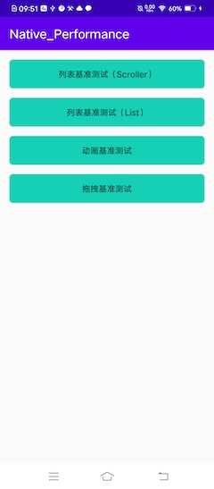
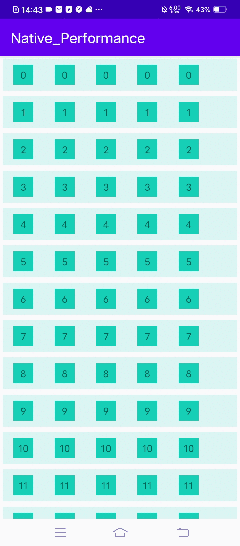
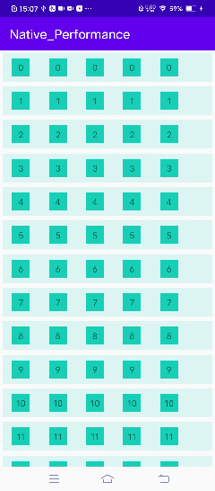
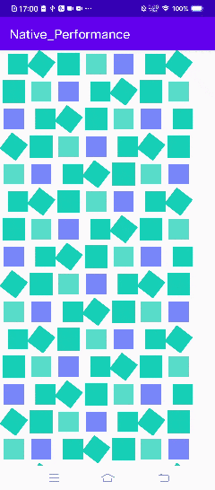
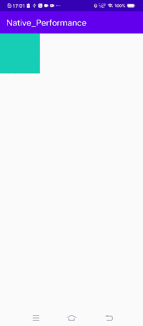

## 简介
此目录下包含了五种不同的 APP 开发框架的工程项目（**Native**、**Hummer**、**Tenon**、**ReactNative** 和 **Flutter**），分别用这五种 APP 开发框架，针对四种不同的测试用例（见下面用例介绍），对四组不同维度的性能指标（**首屏渲染时间**、**CPU**、**内存和帧率**），分别做了各自benchmark性能测试，并且保存了相关测试数据。其中每个 App 开发框架，都包含了 **Android** 和 **iOS** 两端的工程项目。

## 用例介绍
- **用例1：** 列表基准测试（Scroller）。列表中500行视图，每一行视图中包含5个子视图，测试快速滚动整个列表时的性能。
- **用例2：** 列表视图基准测试（List）。列表中1000行视图，每一行视图中包含5个子视图，测试快速滚动整个列表时的性能。
- **用例3：** 动画基准测试。500个视图，每个视图分别做5种动画中的其中1种，测试所有动画同时执行时的性能。
- **用例4：** 拖拽基准测试。测试在屏幕范围内拖拽一个视图时的性能。

## 测试机型
### Android
- **系统：** Android 10
- **型号：** vivo X27 Pro - V1836A
- **vivo ROM：** Funtouch OS_10  PD1836_A_6.20.1
### iOS
- **系统：** iOS 14.4
- **型号：** iPhoneX

## 测试版本
- **Hummer(Android):** 'com.didi.hummer:hummer:0.3.18'
- **Hummer(iOS):** 0.2.3
- **Tenon:** 1.2.1
- **Weex:** 'com.taobao.android:weex_sdk:0.26.0'
- **ReactNative:** 'com.facebook.react:react-native:0.63.4'
- **Flutter:** 1.22.6

## 用例页面
下面是以 Native 用例为例做的页面截图，其他 App 开发框架的用例运行页面效果均与 Native 用例相同。

| 首页 | 用例1 | 用例2 | 用例3 | 用例4 |
| ---- | ---- | ---- | ---- | ---- |
|  |  |  |  |  |

## 测试结果
（待补充）

